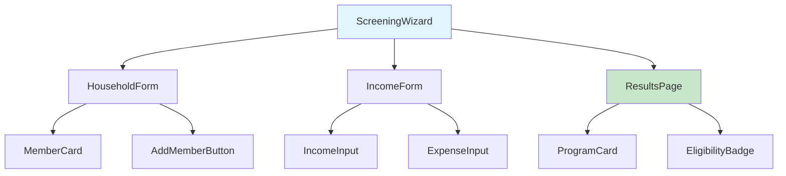
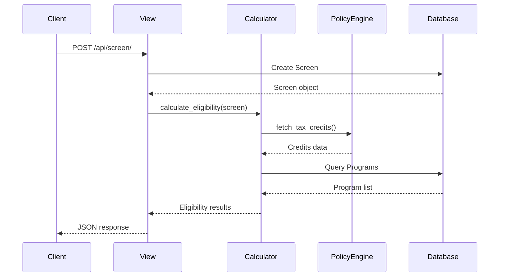
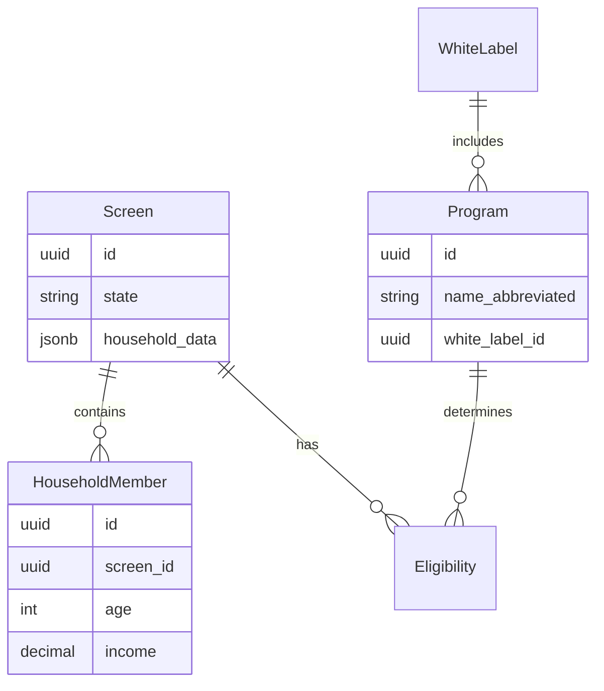

<command-name>linear-code-review</command-name>

# Linear Code Review - Comprehensive PR Analysis Workflow

Automatically discovers all Linear tickets in the "Code Review" state (or analyzes a specific ticket), reviews their associated Pull Requests, and generates comprehensive, junior-dev-friendly reviews with visual diagrams, analogies, and staff-level technical insights.

## Usage Modes

1. **Review all tickets**: `/linear-code-review` - Reviews all tickets in "Code Review" state
2. **Review specific ticket**: `/linear-code-review MFB-123` - Reviews only the specified ticket

## Core Principles

- **Educational**: Reviews should help junior developers understand the code
- **Visual**: Use diagrams (Mermaid) to explain architecture and data flow
- **Analogies**: Explain complex concepts with real-world comparisons
- **Staff-level rigor**: Apply senior engineering expertise to identify issues
- **Security-first**: Always check for vulnerabilities and security concerns
- **Impact analysis**: Identify potential breaking changes and dependencies

## Workflow Phases

### Phase 1: Discovery (Automated)

**Linear Workspace Configuration:**
- This command queries the "MFB - Web" **team** (not project) in Linear
- It looks for issues with state "Code Review" (or a specific ticket if provided)
- No manual discovery needed - these values are hardcoded for the MyFriendBen workspace

1. **Announce start of workflow**

   **If no ticket number provided (review all):**
   ```
   🔍 Starting Code Review PR Discovery...
   Searching Linear for tickets in "Code Review" state in "MFB - Web" team...
   ```

   **If ticket number provided (review one):**
   ```
   🔍 Starting Code Review for MFB-123...
   Fetching ticket details from Linear...
   ```

2. **Query Linear for tickets**

   **Mode A: Review all tickets in Code Review**
   - Use Linear MCP to list issues with these exact parameters:
     - **team**: "MFB - Web" (this is a team name, not a project)
     - **state**: "Code Review"
     - **includeArchived**: false
   - Call: `mcp__Linear__list_issues` with:
     ```json
     {
       "team": "MFB - Web",
       "state": "Code Review",
       "includeArchived": false
     }
     ```
   - **Important**: Use the `team` parameter, NOT `project`. "MFB - Web" is a Linear team.

   **Mode B: Review specific ticket**
   - Use Linear MCP to get single issue:
     - Call `mcp__Linear__get_issue` with the ticket ID (e.g., "MFB-123")
     - No state filtering needed - reviews the ticket regardless of state
   - Skip to step 3 with this single ticket

3. **Extract PR links from each ticket**
   - For each Linear issue found:
     - Use `mcp__Linear__get_issue` to get full issue details
     - Extract GitHub PR URLs from issue description and attachments
     - Parse PR numbers from URLs (format: `github.com/owner/repo/pull/{number}`)
   - Handle multiple PRs per ticket

4. **Present discovery summary**

   **Mode A: All tickets**
   ```
   Found 5 tickets in Code Review:

   1. MFB-123: Add SNAP eligibility calculator
      PRs: #456, #457

   2. MFB-124: Update white label configuration UI
      PRs: #458

   3. MFB-125: Fix income validation bug
      PRs: #459

   ... (continue for all tickets)

   Total: 5 tickets, 7 PRs
   ```

   **Mode B: Single ticket**
   ```
   Ticket MFB-123: Add SNAP eligibility calculator
   State: Code Review
   PRs found: #456, #457

   Total: 1 ticket, 2 PRs
   ```

5. **CHECKPOINT 1: Confirm before proceeding**

   **Mode A: All tickets**
   - Ask: "Ready to review all 7 PRs? This will generate comprehensive reviews. (y/n)"
   - If no, ask if user wants to select specific tickets
   - If yes, proceed to Phase 2

   **Mode B: Single ticket**
   - Ask: "Ready to review 2 PRs for MFB-123? (y/n)"
   - If yes, proceed to Phase 2
   - If no, exit

### Phase 2: PR Analysis (Automated, per PR)

For each PR found:

#### Step 2.1: Fetch PR Details

1. **Get PR metadata**
   ```bash
   gh pr view {PR-number} --json number,title,body,state,author,files,additions,deletions,labels
   ```

2. **Determine repository context**
   - Check which repo the PR belongs to
   - Set review perspective:
     - `benefits-api/` → Backend (Django/Python)
     - `benefits-calculator/` → Frontend (React/TypeScript)
     - Data-related paths → Data Engineering
   - Can have mixed changes (e.g., both frontend and backend)

3. **Get file changes**
   ```bash
   gh pr diff {PR-number}
   ```

4. **Read full context of changed files**
   - For each modified file, read the complete file (not just diff)
   - Understand the broader context
   - Identify dependencies and imports

#### Step 2.2: Code Analysis

**Analyze changes based on file type:**

**For Frontend (React/TypeScript) - Staff React/TS Engineer Perspective:**
- Component structure and composition
- Props typing and TypeScript usage
- State management patterns (hooks, Context, React Query)
- Performance considerations (memoization, lazy loading)
- Accessibility (a11y) compliance
- Error boundary usage
- API integration patterns
- Material-UI usage and theming
- Responsive design implementation
- Test coverage (React Testing Library)

**For Backend (Django/Python) - Staff Django/Python Engineer Perspective:**
- Model design and relationships
- QuerySet and manager usage (avoid N+1 queries)
- Fat models, skinny views adherence
- Service layer for complex operations
- Type hints completeness
- Error handling and validation
- Database migration considerations
- REST API design (DRF patterns)
- Security: SQL injection, XSS, CSRF protection
- Test coverage (pytest, Django TestCase)

**For Data (Python) - Staff Data Engineer Perspective:**
- Data pipeline architecture
- Data validation and quality checks
- Performance and scalability
- Error handling in ETL processes
- Data type consistency
- Schema migrations
- Integration patterns
- Logging and monitoring
- Test coverage

#### Step 2.3: Security Analysis

**CRITICAL: Check for security vulnerabilities:**

- **Input validation**: Are all user inputs validated and sanitized?
- **SQL injection**: Are queries parameterized? Any raw SQL?
- **XSS prevention**: Is output escaped? Dangerous `dangerouslySetInnerHTML`?
- **Authentication/Authorization**: Are endpoints properly protected?
- **Sensitive data exposure**: Secrets in code? PII handling?
- **CSRF protection**: Are state-changing operations protected?
- **Dependency vulnerabilities**: New dependencies introduced?
- **API security**: Rate limiting, input validation, error messages?

#### Step 2.4: Impact Analysis

**Check for breaking changes and dependencies:**

1. **Identify what changed**
   - Function signatures modified?
   - Database schema changes?
   - API endpoint changes?
   - Component props changes?
   - Environment variables added/removed?

2. **Search for usages**
   - Use Grep to find all references to changed code
   - Identify dependent files, components, or modules
   - Check if tests cover the dependencies

3. **Assess impact**
   - Will existing code break?
   - Do migrations need to run in a specific order?
   - Are there backward compatibility concerns?
   - Will this affect other features/modules?

4. **Document findings**
   - List all potentially affected areas
   - Recommend additional testing
   - Suggest migration strategy if needed

#### Step 2.5: Generate Review Document

**Create comprehensive review in Markdown format:**

**Structure:**
```markdown
# Code Review: {Linear Ticket Number}

**PR**: #{PR-number} - {PR Title}
**Ticket**: [{Ticket Number}](Linear URL)
**Author**: {PR Author}
**Type**: {Frontend/Backend/Data/Full-stack}
**Reviewed**: {Date}

---

## 🎓 Junior Developer Explanation

{2-3 paragraph explanation of what this PR does, written for someone new to the codebase}

### What Problem Does This Solve?

{Explain the business problem or bug being addressed}

### How Does It Work?

{High-level explanation with analogy}

**Analogy**: {Real-world comparison that makes the concept relatable}

Example: "Think of this component like a restaurant menu. The parent component (restaurant) passes down available dishes (props), and this component displays them in different sections (breakfast, lunch, dinner). When a customer (user) selects an item, it sends the order (callback) back to the restaurant to process."

---

## 📊 Visual Architecture

{Mermaid diagrams showing:
- Component hierarchy (for frontend)
- Data flow
- Database relationships (for backend)
- API calls and responses
- State management flow
}

### Component/Module Diagram

```mermaid
{Appropriate diagram type: flowchart, sequenceDiagram, classDiagram, etc.}
```

### Data Flow

```mermaid
{Show how data moves through the system}
```

---

## 🔍 Staff Engineer Review

### Architecture & Design

**Strengths:**
- {List architectural wins}
- {Design patterns used correctly}

**Concerns:**
- {Architectural issues}
- {Design pattern violations}

**Recommendations:**
- {Suggested improvements}

### Code Quality

**Strengths:**
- {Clean code examples}
- {Good practices followed}

**Needs Improvement:**
- {Code smells}
- {Complexity issues}
- {Missing patterns}

### Testing

**Current Coverage:**
- {Test files added/modified}
- {Types of tests: unit, integration, e2e}

**Gaps:**
- {Missing test scenarios}
- {Edge cases not covered}
- {Recommended additional tests}

---

## 🔒 Security Analysis

{For each security concern category, either ✅ PASS or ⚠️ CONCERN with details}

- **Input Validation**: {Assessment}
- **SQL Injection**: {Assessment}
- **XSS Prevention**: {Assessment}
- **Authentication/Authorization**: {Assessment}
- **Sensitive Data**: {Assessment}
- **CSRF Protection**: {Assessment}
- **Dependencies**: {Assessment}

**Critical Issues:** {Any security vulnerabilities that must be addressed}

**Recommendations:** {Security improvements}

---

## 💥 Impact Analysis

### What Changed

{List of key changes with file paths}

### Potential Impact

**Direct Dependencies:**
- {Files/modules that directly import or use changed code}
- {Database tables affected by migrations}
- {API endpoints with modified contracts}

**Indirect Dependencies:**
- {Features that might be affected}
- {Components that might need updates}

**Breaking Changes:**
- {List any breaking changes}
- {Migration strategy needed}

### Recommended Additional Testing

- {Manual test scenarios}
- {Regression test areas}
- {Integration test suggestions}

---

## ✅ Checklist

- [ ] Code follows project conventions (Django/React patterns)
- [ ] Tests are comprehensive and passing
- [ ] No security vulnerabilities introduced
- [ ] Breaking changes documented and migrations provided
- [ ] TypeScript types are correct and complete (frontend)
- [ ] Database queries are optimized (backend)
- [ ] Error handling is robust
- [ ] Accessibility requirements met (frontend)
- [ ] Documentation updated if needed

---

## 📝 Summary

**Recommendation**: {APPROVE / REQUEST CHANGES / NEEDS DISCUSSION}

**Key Takeaways:**
1. {Most important point}
2. {Second most important point}
3. {Third most important point}

**Next Steps:**
{What should happen next - merge, address concerns, discuss with team, etc.}

---

*Review generated by Claude Code - {Model used}*
*Linear Ticket: {Ticket link}*
*GitHub PR: {PR link}*
```

5. **Save review to file**
   - Create `/pull-request-reviews/` directory if it doesn't exist
   - Save as `pull-request-reviews/{TICKET-NUMBER}.md`
   - Use ticket number from Linear (e.g., `MFB-123.md`)

6. **Progress update**
   ```
   ✓ Generated review for MFB-123 (PR #456)
     Saved to: pull-request-reviews/MFB-123.md

   Continuing with next PR...
   ```

### Phase 3: Summary (Automated)

After all PRs reviewed:

1. **Generate summary report**
   ```
   ✅ Code Review Complete!

   Reviewed 5 tickets (7 PRs) in Code Review:

   ✓ MFB-123: pull-request-reviews/MFB-123.md (2 PRs)
   ✓ MFB-124: pull-request-reviews/MFB-124.md (1 PR)
   ✓ MFB-125: pull-request-reviews/MFB-125.md (1 PR)
   ✓ MFB-126: pull-request-reviews/MFB-126.md (2 PRs)
   ✓ MFB-127: pull-request-reviews/MFB-127.md (1 PR)

   Security Alerts: 2 PRs flagged for security review
   - MFB-123: Input validation concerns
   - MFB-126: Potential XSS vulnerability

   Breaking Changes: 1 PR has breaking changes
   - MFB-124: API endpoint signature changed

   Recommendations:
   - 3 PRs ready to approve
   - 2 PRs need security fixes
   - 2 PRs need discussion with team

   Next Steps:
   1. Review security concerns in flagged PRs
   2. Address breaking changes in MFB-124
   3. Read individual reviews in pull-request-reviews/ directory
   ```

2. **List all generated files**
   ```bash
   ls -lh pull-request-reviews/
   ```

## Error Handling

### If No Tickets in Code Review

```
ℹ️ No tickets found in "Code Review" state

Checked:
- Team: MFB - Web
- State: Code Review
- Found: 0 tickets

Possible reasons:
- All code reviews completed
- Tickets in different state (In Progress, Done, etc.)
- Team name or state changed

Check Linear workspace to verify.
```

### If Specific Ticket Not Found

```
❌ Error: Ticket MFB-999 not found

Checked Linear workspace for ticket "MFB-999" but it doesn't exist.

Possible reasons:
- Ticket ID is incorrect (check spelling/number)
- Ticket has been deleted
- Ticket is in a different workspace

Verify the ticket ID and try again.
```

### If Ticket Has No PRs

```
⚠️ Warning: MFB-123 has no linked PRs

Ticket: "Add SNAP eligibility calculator"
State: Code Review

The Linear-GitHub integration may not have linked the PR, or the PR URL may not be in the ticket description.

Options:
A) Skip this ticket
B) Manually provide PR number
C) Stop workflow

Which option? (A/B/C)
```

### If PR Cannot Be Fetched

```
❌ Error: Could not fetch PR #456

Possible issues:
- PR number incorrect
- PR in different repository
- GitHub API authentication failed
- PR has been deleted

Try: gh pr view 456 --repo owner/repo

Skip this PR and continue? (y/n)
```

### If Review Generation Fails

```
❌ Error: Failed to generate review for MFB-123

Error: {error details}

The review was partially generated and saved to:
pull-request-reviews/MFB-123.partial.md

Continue with remaining PRs? (y/n)
```

## Best Practices

### Review Quality

✅ **Always include:**
- Junior-friendly explanation with analogies
- At least 2 Mermaid diagrams showing architecture/flow
- Staff-level technical insights
- Security analysis for every PR
- Impact analysis with dependency checking
- Concrete recommendations with examples

✅ **Diagrams should:**
- Use appropriate Mermaid diagram types
- Show component relationships (frontend)
- Show data flow and API calls
- Show database relationships (backend)
- Be clear and not overly complex
- Include labels and descriptions

✅ **Security checks must cover:**
- All OWASP Top 10 categories relevant to the change
- Input validation thoroughly
- Authentication/authorization boundaries
- Sensitive data handling
- Common vulnerability patterns for the framework (Django/React)

### Writing Style

✅ **For junior developers:**
- Avoid jargon or explain it when used
- Use real-world analogies
- Explain "why" not just "what"
- Include code examples in recommendations
- Be encouraging about good patterns found

✅ **For staff engineer section:**
- Be precise and technical
- Reference design patterns by name
- Point to specific line numbers and files
- Provide architectural alternatives
- Cite framework best practices

### Impact Analysis

✅ **Always check:**
- Search codebase for all references to changed functions/components
- Check for database migration dependencies
- Identify API contract changes
- Look for environment variable additions
- Find test files that might need updates
- Consider white-label variations (MyFriendBen specific)

### Efficiency

✅ **Optimize the workflow:**
- Run PR fetches in parallel when possible
- Use Glob/Grep for dependency searches
- Read files in batch when reviewing related changes
- Cache repository context across PRs in same repo

## Diagram Examples

### Frontend Component Diagram



### Backend Data Flow



### Database Relationship



## File Organization

```
pull-request-reviews/
├── MFB-123.md          # SNAP calculator review
├── MFB-124.md          # White label UI review
├── MFB-125.md          # Income validation review
├── MFB-126.md          # Data pipeline review
└── MFB-127.md          # Authentication fix review
```

## Integration with Team Workflow

1. **Discovery**: Linear MCP finds tickets in Code Review
2. **Analysis**: Claude reviews each PR comprehensively
3. **Documentation**: Reviews saved locally for team reference
4. **Discussion**: Team reads reviews, discusses concerns
5. **Action**: Address security/impact issues before merge
6. **Learning**: Junior devs learn from explanations and diagrams

## Success Criteria

- ✅ All Code Review tickets discovered
- ✅ All PRs found and analyzed
- ✅ Reviews are junior-dev friendly with analogies
- ✅ At least 2 diagrams per review
- ✅ Security analysis complete for every PR
- ✅ Impact analysis identifies dependencies
- ✅ Staff-level insights for architecture/design
- ✅ All reviews saved to pull-request-reviews/ directory
- ✅ Summary report generated
- ✅ No PRs skipped without user approval

## Notes

- Reviews are **educational** - help team learn, not just critique
- Use **Mermaid diagrams** extensively - visual learning is powerful
- **Security is critical** - every PR gets thorough security review
- **Impact analysis prevents bugs** - find breaking changes before merge
- Reviews are **saved locally** - team can reference and learn from them
- Multiple PRs per ticket are **common** - handle gracefully

---

**Remember**: The goal is to help the whole team (especially junior developers) understand the code deeply, catch issues early, and maintain high quality standards. Reviews should be thorough but kind, technical but accessible.
