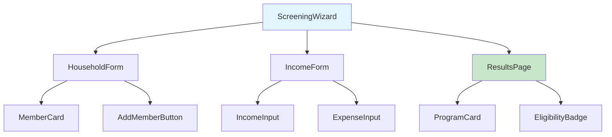
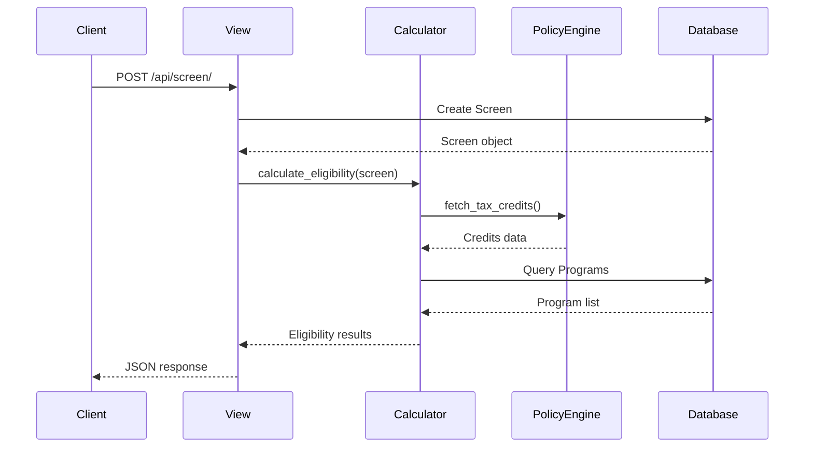
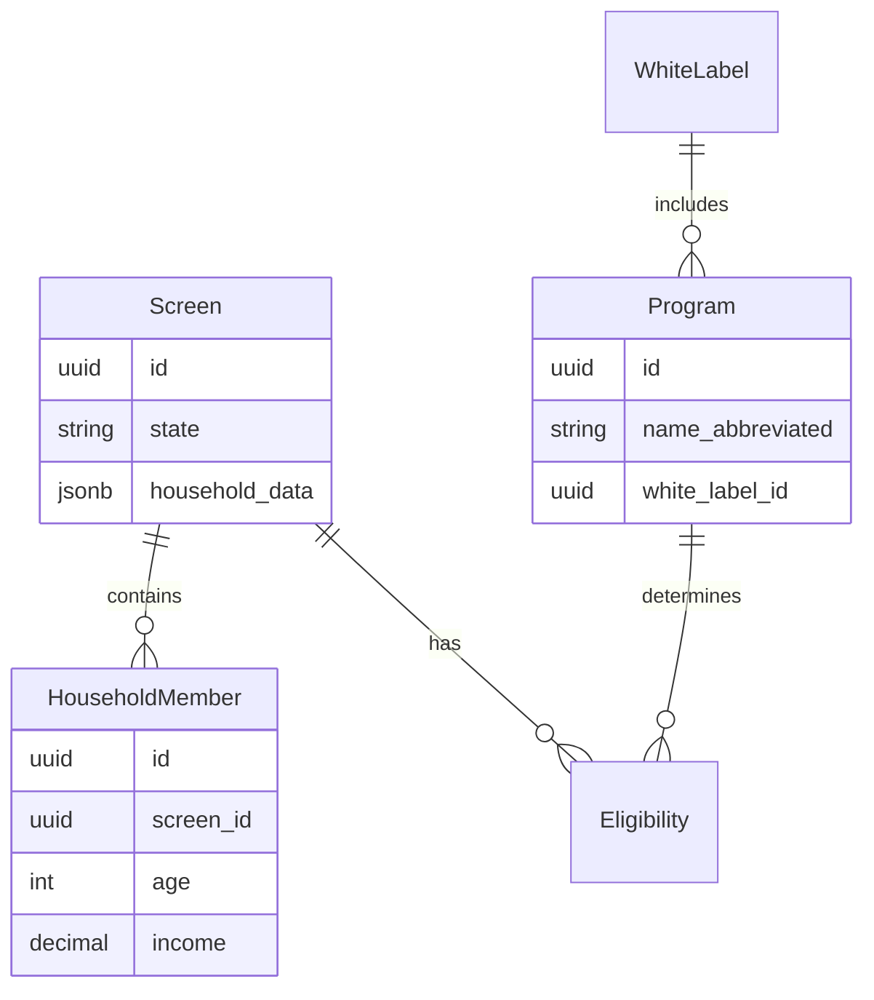

# Linear Code Review - Comprehensive PR Analysis Workflow

Analyzes a specific Linear ticket, reviews its associated Pull Request(s), and generates a comprehensive review with visual diagrams and staff-level technical insights.

## Usage

`/linear-code-review MFB-123` - Reviews the specified ticket's PR(s)

## Core Principles

- **Educational**: Reviews should help junior developers understand the code
- **Visual**: Use diagrams (Mermaid) to explain architecture and data flow
- **Staff-level rigor**: Apply senior engineering expertise to identify issues
- **Security-first**: Always check for vulnerabilities and security concerns
- **Impact analysis**: Identify potential breaking changes and dependencies

## Workflow Phases

### Phase 1: Discovery (Automated)

1. **Announce start of workflow**
   ```
   Starting Code Review for MFB-123...
   Fetching ticket details from Linear...
   ```

2. **Query Linear for ticket**
   - Call `mcp__Linear__get_issue` with the ticket ID (e.g., "MFB-123")
   - No state filtering needed — reviews the ticket regardless of state

3. **Extract PR links from the ticket**
   - Use `mcp__Linear__get_issue` to get full issue details
   - Extract GitHub PR URLs from issue description and attachments
   - Parse PR numbers from URLs (format: `github.com/owner/repo/pull/{number}`)
   - If no PR links found, **ask the user**: "No PR link found for MFB-XXX. Please paste the GitHub PR URL(s) for this ticket."
   - Do NOT attempt to search git branches or run git commands to discover PRs

4. **Present discovery summary**
   ```
   Ticket MFB-123: Add SNAP eligibility calculator
   State: Code Review
   PRs found: #456, #457
   ```

5. **Confirm before proceeding**
   - Ask: "Ready to review PR(s) for MFB-123? (y/n)"
   - If yes, proceed to Phase 2
   - If no, exit

### Phase 2: PR Analysis (Automated)

For each PR associated with the ticket:

#### Step 2.1: Fetch PR Details

1. **Get PR metadata**
   ```bash
   gh pr view {PR-number} --json number,title,body,state,author,files,additions,deletions,labels
   ```

2. **Determine repository context**
   - Check which repo the PR belongs to
   - Set review perspective:
     - `benefits-api/` → Backend (Django/Python)
     - `benefits-calculator/` → Frontend (React/TypeScript)
     - Data-related paths → Data Engineering
   - Can have mixed changes (e.g., both frontend and backend)

3. **Get file changes**
   ```bash
   gh pr diff {PR-number}
   ```

4. **Read full context of changed files**
   - For each modified file, read the complete file (not just diff)
   - Understand the broader context
   - Identify dependencies and imports

#### Step 2.2: Code Analysis

**Analyze changes based on file type:**

**For Frontend (React/TypeScript) - Staff React/TS Engineer Perspective:**
- Component structure and composition
- Props typing and TypeScript usage
- State management patterns (hooks, Context, React Query)
- Performance considerations (memoization, lazy loading)
- Accessibility (a11y) compliance
- Error boundary usage
- API integration patterns
- Material-UI usage and theming
- Responsive design implementation
- Test coverage (React Testing Library)

**For Backend (Django/Python) - Staff Django/Python Engineer Perspective:**
- Model design and relationships
- QuerySet and manager usage (avoid N+1 queries)
- Fat models, skinny views adherence
- Service layer for complex operations
- Type hints completeness
- Error handling and validation
- Database migration considerations
- REST API design (DRF patterns)
- Security: SQL injection, XSS, CSRF protection
- Test coverage (pytest, Django TestCase)

**For Data (Python) - Staff Data Engineer Perspective:**
- Data pipeline architecture
- Data validation and quality checks
- Performance and scalability
- Error handling in ETL processes
- Data type consistency
- Schema migrations
- Integration patterns
- Logging and monitoring
- Test coverage

#### Step 2.3: Security Analysis

**CRITICAL: Check for security vulnerabilities:**

- **Input validation**: Are all user inputs validated and sanitized?
- **SQL injection**: Are queries parameterized? Any raw SQL?
- **XSS prevention**: Is output escaped? Dangerous `dangerouslySetInnerHTML`?
- **Authentication/Authorization**: Are endpoints properly protected?
- **Sensitive data exposure**: Secrets in code? PII handling?
- **CSRF protection**: Are state-changing operations protected?
- **Dependency vulnerabilities**: New dependencies introduced?
- **API security**: Rate limiting, input validation, error messages?

#### Step 2.4: Impact Analysis

**Check for breaking changes and dependencies:**

1. **Identify what changed**
   - Function signatures modified?
   - Database schema changes?
   - API endpoint changes?
   - Component props changes?
   - Environment variables added/removed?

2. **Search for usages**
   - Use Grep to find all references to changed code
   - Identify dependent files, components, or modules
   - Check if tests cover the dependencies

3. **Assess impact**
   - Will existing code break?
   - Do migrations need to run in a specific order?
   - Are there backward compatibility concerns?
   - Will this affect other features/modules?

4. **Document findings**
   - List all potentially affected areas
   - Recommend additional testing
   - Suggest migration strategy if needed

#### Step 2.5: Automated Follow-Up Analyses

Run these checks automatically for every PR. Each is conditional on what the PR actually changes — skip gracefully with a note if not applicable.

**A. Business Logic Correctness** *(if PR adds or modifies a calculator or eligibility rule)*

1. Detect whether the PR touches any file matching `programs/programs/{state}/{program}/` or any calculator/eligibility file
2. If yes, find the corresponding `spec.md` for the affected program(s)
3. Read the spec and compare it line-by-line against the calculator implementation in the diff
4. Document:
   - Rules implemented correctly
   - Any discrepancies between spec and code (wrong thresholds, missing conditions, incorrect benefit amounts)
   - Any spec rules not covered by the implementation
5. If no calculator changes detected, note: "Not applicable — no eligibility logic modified in this PR."

**B. White-Label / Multi-Tenant Behavior** *(always run)*

1. Identify all functions, classes, API endpoints, or model fields changed in the PR
2. Search white label config files (e.g., `configuration/`, `whitelabel/`, any `*white_label*` or `*whitelabel*` files) for references to those identifiers
3. Check for any white-label-specific overrides that interact with the changed code
4. Document:
   - Which white labels reference the changed code
   - Whether any white label could behave differently or break
   - Any white labels that need config updates alongside this PR
5. If no white-label-specific impact found, note: "No white label configurations reference the changed code."

**C. Translation Completeness** *(if PR introduces new user-facing strings)*

1. Scan the diff for new hardcoded strings rendered in the UI (React components, Django templates, serializer messages, error text)
2. Check whether each string has a corresponding translation key (look for `Translation` model usage, i18n patterns, or translation key references)
3. Check the PR description for a "Deployment" section that lists new translation keys
4. Document:
   - All new user-facing strings found
   - Which ones already have translation keys wired up
   - Which ones are missing translation keys entirely
   - Which ones have keys but are not documented in the PR's Deployment section
5. Include a ready-to-use list of key names and default English values for any missing entries
6. If no new user-facing strings detected, note: "No new translatable strings introduced."

**D. Migration Safety** *(if PR includes Django migrations)*

1. Detect any new or modified files under `*/migrations/`
2. For each migration file, read the full migration and analyze:
   - **Long-running operations**: large table alterations, adding non-nullable columns without defaults, bulk data operations
   - **Missing indexes**: foreign keys or frequently-queried fields added without `db_index=True`
   - **Unsafe schema changes**: dropping columns, renaming columns/tables, changing field types
   - **Data loss risk**: any `RunPython` that modifies or deletes existing rows
   - **Dependency ordering**: `dependencies` list correct relative to other migrations in the PR
3. Document each concern with the migration file and operation name
4. Note: "Migration must be confirmed to apply cleanly via `python manage.py migrate` on a local branch pull before approving — it runs automatically on staging at merge."
5. If no migrations detected, note: "No database migrations in this PR."

---

#### Step 2.6: Generate Review Document

**Create comprehensive review in Markdown format:**

**Structure:**
```markdown
# Code Review: {Linear Ticket Number}

**PR**: #{PR-number} - {PR Title}
**Ticket**: [{Ticket Number}](Linear URL)
**Author**: {PR Author}
**Type**: {Frontend/Backend/Data/Full-stack}
**Reviewed**: {Date}

---

## PR Overview

{1-2 paragraph explanation of what this PR does and why, written accessibly for someone new to the codebase}

### What Problem Does This Solve?

{Explain the business problem or bug being addressed}

### How Does It Work?

{Organized as subheadings representing broad effects of the PR. Under each subheading, bullet points list the specific code changes that contribute to that effect. Focus on what the changes do in the context of the repo — no analogies.}

#### {Broad Effect 1}
- {Specific change that contributes to this effect}
- {Another specific change}

#### {Broad Effect 2}
- {Specific change}

---

## Visual Architecture

{Mermaid diagrams showing:
- Component hierarchy (for frontend)
- Data flow
- Database relationships (for backend)
- API calls and responses
- State management flow
}

### Component/Module Diagram

` ``mermaid
{Appropriate diagram type: flowchart, sequenceDiagram, classDiagram, etc.}
` ``

### Data Flow

` ``mermaid
{Show how data moves through the system}
` ``

---

## Code Review

### {Broad Change 1 — e.g., "Remove dead code stub"}

{Short explanation of what should change and why}

```python
# Before
{existing code}

# After
{recommended code}
```

### {Broad Change 2 — e.g., "Tighten age-guard logic"}

{Short explanation}

```python
# Recommended
{code block}
```

{Add or omit code blocks as needed — not every recommendation requires one, but include one whenever it clarifies the change}

---

## Security Analysis

{For each security concern category, either PASS or CONCERN with details}

- **Input Validation**: {Assessment}
- **SQL Injection**: {Assessment}
- **XSS Prevention**: {Assessment}
- **Authentication/Authorization**: {Assessment}
- **Sensitive Data**: {Assessment}
- **CSRF Protection**: {Assessment}
- **Dependencies**: {Assessment}

**Critical Issues:** {Any security vulnerabilities that must be addressed}

**Recommendations:** {Security improvements}

---

## Impact Analysis

### What Changed

{List of key changes with file paths}

### Potential Impact

**Direct Dependencies:**
- {Files/modules that directly import or use changed code}
- {Database tables affected by migrations}
- {API endpoints with modified contracts}

**Indirect Dependencies:**
- {Features that might be affected}
- {Components that might need updates}

**Breaking Changes:**
- {List any breaking changes}
- {Migration strategy needed}

### Recommended Additional Testing

- {Manual test scenarios}
- {Regression test areas}
- {Integration test suggestions}

---

## Business Logic Correctness

{Skip section with "N/A — no eligibility logic modified" if not applicable}

**Spec compared**: `programs/programs/{state}/{program}/spec.md`

**Correctly implemented:**
- {Rules from spec that the code handles correctly}

**Discrepancies found:**
- {Rule | Spec says X | Code does Y}

**Spec rules not covered:**
- {Any eligibility conditions or benefit calculations in the spec with no corresponding implementation}

---

## White-Label / Multi-Tenant Impact

**White labels referencing changed code:**
- {WhiteLabel name | file | what it references}

**Potential behavioral differences:**
- {Description of how a specific white label could be affected}

**Config updates required:**
- {Any white label configs that need changes alongside this PR, or "None identified"}

---

## Translation Completeness

{Skip section with "N/A — no new user-facing strings" if not applicable}

**New strings requiring translation keys:**

| String | Translation Key | Status |
|--------|----------------|--------|
| {string text} | {key name} | Missing / Present / Not in Deployment section |

**Missing from PR Deployment section:**
- {key: `key_name`, default: `"English value"`}

---

## Migration Safety

{Skip section with "N/A — no migrations in this PR" if not applicable}

**Migrations reviewed:**
- {migration filename}

**Findings:**

| Operation | Risk | Detail |
|-----------|------|--------|
| {AlterField / AddField / etc.} | {High/Medium/Low/None} | {Explanation} |

**Overall assessment**: {Safe to merge / Needs review / Blocking concern}

**Reminder**: Pull branch locally and run `python manage.py migrate` to confirm it applies cleanly before approving.

---

## Checklist

- [ ] Code follows project conventions (Django/React patterns)
- [ ] Tests are comprehensive and passing
- [ ] No security vulnerabilities introduced
- [ ] Breaking changes documented and migrations provided
- [ ] TypeScript types are correct and complete (frontend)
- [ ] Database queries are optimized (backend)
- [ ] Error handling is robust
- [ ] Accessibility requirements met (frontend)
- [ ] Documentation updated if needed
- [ ] Business logic matches program spec (if applicable)
- [ ] White label impact assessed
- [ ] Translation keys added for all new user-facing strings (if applicable)
- [ ] Migration safety verified (if applicable)

---

## Summary

**Recommendation**: {APPROVE / REQUEST CHANGES / NEEDS DISCUSSION}

**Key Takeaways:**
1. {Most important point}
2. {Second most important point}
3. {Third most important point}

**Next Steps:**
{What should happen next - merge, address concerns, discuss with team, etc.}

---

*Review generated by Claude Code - {Model used}*
*Linear Ticket: {Ticket link}*
*GitHub PR: {PR link}*
```

5. **Save review to file**
   - Create `/pull-request-reviews/` directory if it doesn't exist
   - Save as `pull-request-reviews/{TICKET-NUMBER}.md`
   - Use ticket number from Linear (e.g., `MFB-123.md`)

6. **Completion summary**
   ```
   Code Review Complete!

   Ticket: MFB-123
   Review saved to: pull-request-reviews/MFB-123.md

   Recommendation: {APPROVE / REQUEST CHANGES / NEEDS DISCUSSION}

   Key issues:
   - {Top concern, if any}
   - {Second concern, if any}
   ```

## Error Handling

### If Ticket Not Found

```
Error: Ticket MFB-999 not found

Checked Linear workspace for ticket "MFB-999" but it doesn't exist.

Possible reasons:
- Ticket ID is incorrect (check spelling/number)
- Ticket has been deleted
- Ticket is in a different workspace

Verify the ticket ID and try again.
```

### If Ticket Has No PRs

```
No PR link found for MFB-123 ("Add SNAP eligibility calculator").

Please paste the GitHub PR URL(s) for this ticket:
```

Wait for the user to provide the URL(s), then continue with Phase 2. Do not attempt to search git history or branches.

### If PR Cannot Be Fetched

```
Error: Could not fetch PR #456

Possible issues:
- PR number incorrect
- PR in different repository
- GitHub API authentication failed
- PR has been deleted

Try: gh pr view 456 --repo owner/repo
```

### If Review Generation Fails

```
Error: Failed to generate review for MFB-123

Error: {error details}

The review was partially generated and saved to:
pull-request-reviews/MFB-123.partial.md
```

## Best Practices

### Review Quality

**Always include:**
- Junior-friendly PR overview written for someone new to the codebase
- At least 2 Mermaid diagrams showing architecture/flow
- Staff-level technical insights
- Security analysis for every PR
- Impact analysis with dependency checking
- Concrete recommendations with code examples

**Diagrams should:**
- Use appropriate Mermaid diagram types
- Show component relationships (frontend)
- Show data flow and API calls
- Show database relationships (backend)
- Be clear and not overly complex
- Include labels and descriptions

**Security checks must cover:**
- All OWASP Top 10 categories relevant to the change
- Input validation thoroughly
- Authentication/authorization boundaries
- Sensitive data handling
- Common vulnerability patterns for the framework (Django/React)

### Writing Style

**For the PR Overview:**
- Avoid jargon or explain it when used
- Explain "why" not just "what"
- Keep it accessible — assume the reader knows how to code but not this codebase

**For the Code Review section:**
- Be precise and technical
- Reference design patterns by name
- Point to specific line numbers and files
- Provide concrete recommended code blocks
- Cite framework best practices

### Impact Analysis

**Always check:**
- Search codebase for all references to changed functions/components
- Check for database migration dependencies
- Identify API contract changes
- Look for environment variable additions
- Find test files that might need updates
- Consider white-label variations (MyFriendBen specific)

### Efficiency

**Optimize the workflow:**
- Use Glob/Grep for dependency searches
- Read files in batch when reviewing related changes

## Diagram Examples

### Frontend Component Diagram



### Backend Data Flow



### Database Relationship



## File Organization

Reviews are saved as `pull-request-reviews/{TICKET-NUMBER}.md` (e.g., `pull-request-reviews/MFB-123.md`).

## Integration with Team Workflow

1. **Invocation**: User runs `/linear-code-review MFB-123`
2. **Analysis**: Claude reviews the ticket's PR(s) comprehensively
3. **Documentation**: Review saved locally for team reference
4. **Discussion**: Team reads review, discusses concerns
5. **Action**: Address security/impact issues before merge

## Success Criteria

- Ticket fetched and PR(s) found
- PR Overview is accessible to someone new to the codebase
- At least 2 diagrams per review
- Security analysis complete
- Impact analysis identifies dependencies
- Staff-level insights for architecture/design
- Review saved to pull-request-reviews/ directory

## Notes

- Reviews are **educational** — help team understand changes, not just critique
- Use **Mermaid diagrams** extensively — visual learning is powerful
- **Security is critical** — every PR gets thorough security review
- **Impact analysis prevents bugs** — find breaking changes before merge
- Reviews are **saved locally** — team can reference and learn from them

---

**Remember**: The goal is to help the whole team understand the code deeply, catch issues early, and maintain high quality standards. Reviews should be thorough, technical, and accessible.
